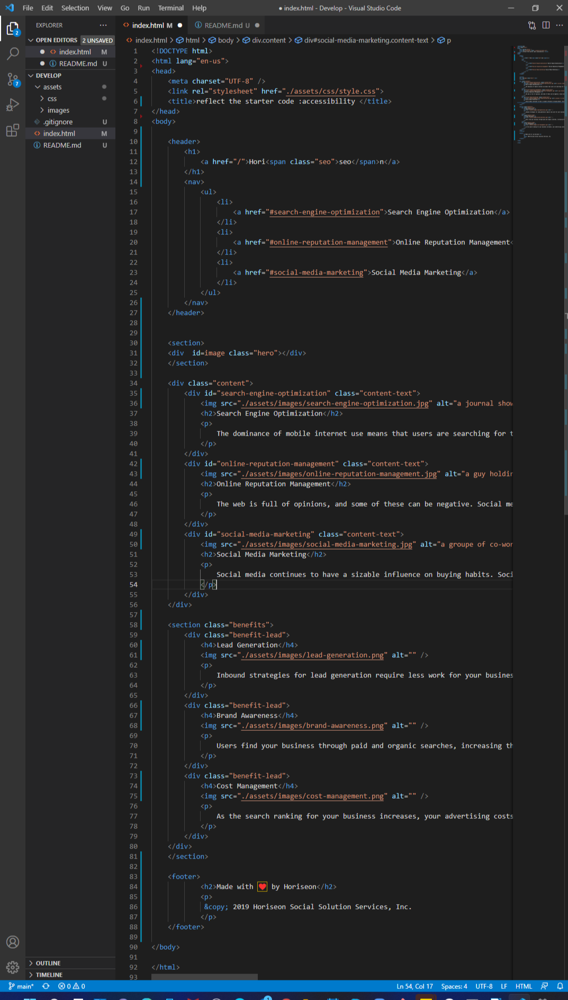
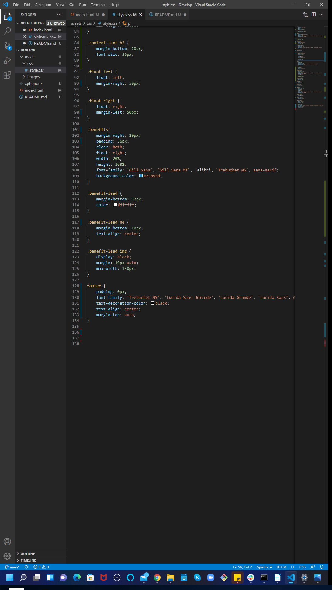

# Code Refactor Starter Code
Purpose:
A website that offers fitness training services.
Built With:
HTML
CSS

put an appropiate tittle
giving the html a sequential order 
updating the IMG element with alt attributs
make the CSS more efficent by consolidating CSS properties and selectors

